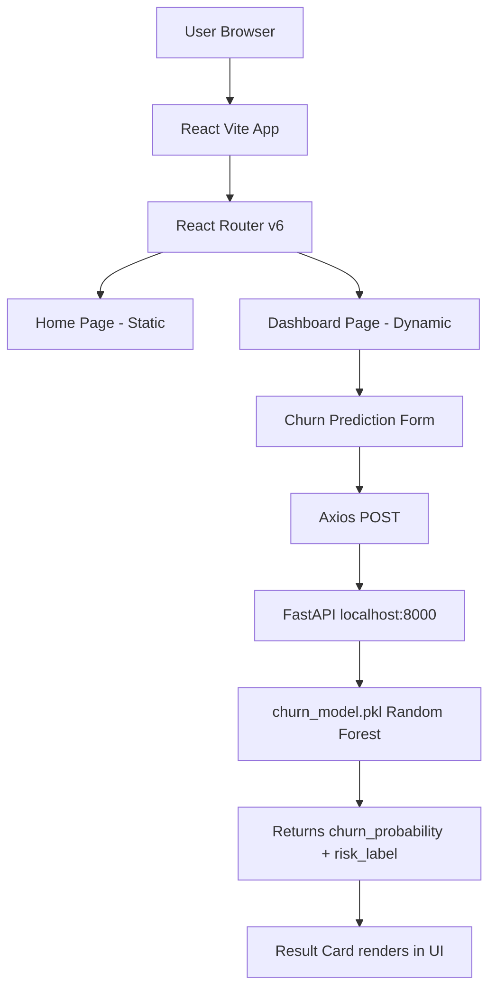
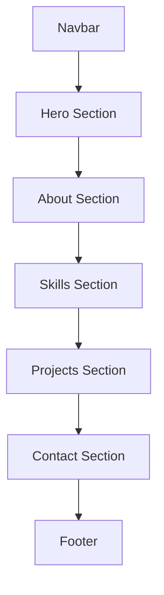
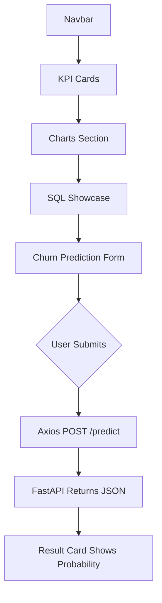
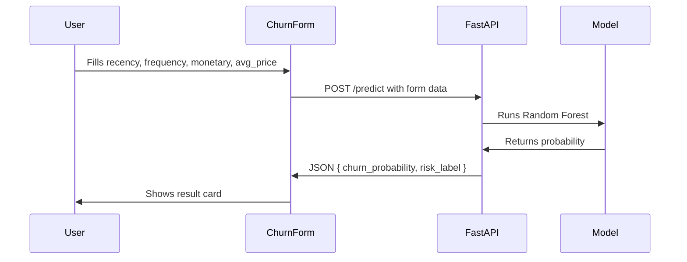

# 🏗️ HLD — High Level Design
## Ecommerce Analytics — Frontend
> Stage 0 | Written before any code |

---

## What This Frontend Does

Single React Vite app that serves two purposes:
1. Portfolio — shows who Ashutosh is and what he built
2. Live churn prediction — form sends customer data to FastAPI, returns churn probability

---

## System Architecture


---

## Pages

| Page | Route | Type | Data Source |
|---|---|---|---|
| Home | `/` | Static | No API call |
| Dashboard | `/dashboard` | Dynamic | FastAPI `/predict` |

---

## Home Page Flow


---

## Dashboard Page Flow


---

## Data Flow


---

## Tech Choices

| Tech | Why |
|---|---|
| React 18 | Component-based, reusable UI |
| Vite | Fast dev server, fast build |
| React Router v6 | Multi-page navigation |
| Axios | Clean API calls, easy error handling |
| TailwindCSS | No custom CSS, dark theme easy |

---

## External Connections

| Connection | Direction | Purpose |
|---|---|---|
| FastAPI `/predict` | Frontend → Backend | Churn prediction |
| FastAPI `/health` | Frontend → Backend | Check backend alive |

---

## What Is NOT In v0

- No auth
- No database
- No real-time data
- No animations
- No mobile optimization
- No deployment
- No tests

---

## Environment Variables Needed
```
VITE_API_URL=http://localhost:8000
```

---

## Related Design Docs

| File | What It Adds |
|---|---|
| [LLD_stage0.md](./LLD_stage0.md) | Every component name + what it does |
| [API_CONTRACTS.md](./API_CONTRACTS.md) | Exact request + response for /predict |
