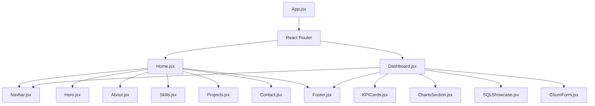
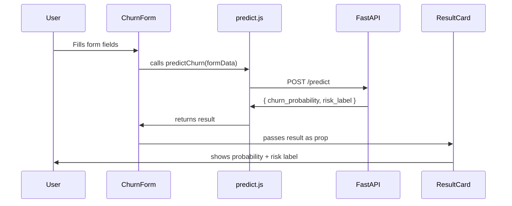

```markdown
# 🔩 LLD — Low Level Design
## Ecommerce Analytics — Frontend
> Stage 0 | Written before any code | 

---

## What LLD Covers

Every component name, what it does, what props it takes, which page it lives in.
No code here — just the blueprint.

---

## Component Tree



---

## Folder Structure

```
src/
  pages/
    Home.jsx
    Dashboard.jsx
  components/
    Navbar.jsx
    Hero.jsx
    About.jsx
    Skills.jsx
    Projects.jsx
    Contact.jsx
    Footer.jsx
    KPICards.jsx
    ChartsSection.jsx
    SQLShowcase.jsx
    ChurnForm.jsx
    ResultCard.jsx
  api/
    predict.js
  styles/
    index.css
  App.jsx
  main.jsx
```

---

## Pages

### Home.jsx
| What | Detail |
|---|---|
| Purpose | Full portfolio landing page |
| Data | All static — no API call |
| Components used | Navbar, Hero, About, Skills, Projects, Contact, Footer |

### Dashboard.jsx
| What | Detail |
|---|---|
| Purpose | Project showcase + live churn prediction |
| Data | Static KPIs + Axios POST to FastAPI |
| Components used | Navbar, KPICards, ChartsSection, SQLShowcase, ChurnForm, Footer |

---

## Components

### Navbar.jsx
| What | Detail |
|---|---|
| Purpose | Top navigation bar on all pages |
| Links | Home, Dashboard, GitHub, LinkedIn |
| State | None |
| Props | None |

---

### Hero.jsx
| What | Detail |
|---|---|
| Purpose | First section user sees — name, title, CTA |
| Content | Name, role, one line bio, button to Dashboard |
| State | None |
| Props | None |

---

### About.jsx
| What | Detail |
|---|---|
| Purpose | Short intro — who Ashutosh is |
| Content | 3-4 lines, fresher, targeting DA/ML roles |
| State | None |
| Props | None |

---

### Skills.jsx
| What | Detail |
|---|---|
| Purpose | Show tech skills visually |
| Content | Python, SQL, Pandas, Scikit-learn, Power BI, React, FastAPI |
| State | None |
| Props | None |

---

### Projects.jsx
| What | Detail |
|---|---|
| Purpose | Project cards — one per project |
| Content | Project name, tech stack, GitHub link, Dashboard link |
| State | None |
| Props | project name, description, tech, githubUrl, demoUrl |

---

### Contact.jsx
| What | Detail |
|---|---|
| Purpose | Links to GitHub and LinkedIn |
| Content | Two buttons — GitHub + LinkedIn |
| State | None |
| Props | None |

---

### Footer.jsx
| What | Detail |
|---|---|
| Purpose | Bottom of every page |
| Content | Built by Ashutosh + year |
| State | None |
| Props | None |

---

### KPICards.jsx
| What | Detail |
|---|---|
| Purpose | Show 4 key business numbers from Olist project |
| Content | Revenue R$16,110,492 · Profit R$5,061,907 · Orders 96,454 · Margin 32.3% |
| State | None |
| Props | None — all hardcoded |

---

### ChartsSection.jsx
| What | Detail |
|---|---|
| Purpose | Show charts from EDA notebooks |
| Content | Monthly trend + Category breakdown — static images |
| State | None |
| Props | None |

---

### SQLShowcase.jsx
| What | Detail |
|---|---|
| Purpose | Show 3 best SQL queries from 60 questions |
| Content | Query + what it answers |
| State | None |
| Props | None |

---

### ChurnForm.jsx
| What | Detail |
|---|---|
| Purpose | User fills form → gets churn prediction |
| Fields | recency, frequency, monetary, avg_price |
| State | formData, result, loading, error |
| On Submit | calls predict.js → Axios POST → FastAPI |

---



---

### ResultCard.jsx
| What | Detail |
|---|---|
| Purpose | Shows churn prediction result |
| Content | Probability percentage + High/Medium/Low label |
| State | None |
| Props | churn_probability, risk_label |

---

## API Layer

### api/predict.js
| What | Detail |
|---|---|
| Purpose | Single function that calls FastAPI /predict |
| Function | `predictChurn(formData)` |
| Method | Axios POST |
| URL | `VITE_API_URL/predict` |
| Input | `{ recency, frequency, monetary, avg_price }` |
| Output | `{ churn_probability, risk_label }` |

---

## State Management

No global state in v0.
Each component manages its own local state with `useState`.

---

## Routing

```
/           → Home.jsx
/dashboard  → Dashboard.jsx
```

Defined in `App.jsx` using React Router v6.

---

## What Is NOT In v0

- No global state (Redux/Zustand)
- No animations
- No loading skeletons
- No error boundaries
- No tests
- No mobile optimization

---

## Related Design Docs

| File | What It Adds |
|---|---|
| [HLD_stage0.md](./HLD_stage0.md) | Big picture architecture |
| [API_CONTRACTS.md](./API_CONTRACTS.md) | Exact request + response for /predict |
```

---

Copy into `LLD_stage0.md` ✅

Tell me when done → move to `API_CONTRACTS.md`
